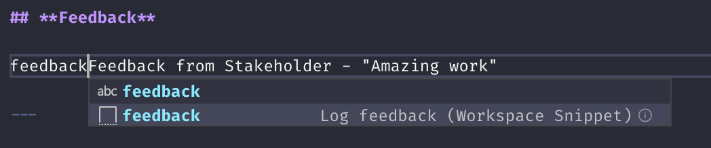
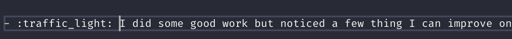

# <!-- omit in toc -->

Tracker system I created to allow me to update with achievements and tag with goals

- [Summary of how it works](#summary-of-how-it-works)
- [Set up](#set-up)
  - [How to customise](#how-to-customise)
  - [How to tag up text](#how-to-tag-up-text)
    - [Adding a goal](#adding-a-goal)
    - [Tagging some feedback](#tagging-some-feedback)
    - [Tagging some personal development observations](#tagging-some-personal-development-observations)
    - [Adding useful info](#adding-useful-info)
    - [Adding training](#adding-training)
  - [How to collate the tags](#how-to-collate-the-tags)
- [Check out some examples](#check-out-some-examples)

---

## Summary of how it works

Weekly updates and sprint details are added to markdown files and can be tagged with specific goals or categories such as feedback or useful info or training etc.

This information can then be collated by running some yarn/npm scripts to generate a summary of the tags you have added

These scripts mainly run shell scripts that grep through the markdown files looking for matches (using regex), reformatting the text so it will work well in the summary pages, and saving the output into temp files.  Currently these are looking for very specific text matches - but I set up some smaller functions to handle the processing so it should be easy(ish) to update the regex used to look for different text to match.

There are also scripts that search through certain folders to dynamically create an index of weekly and sprint reports and adds links to these to the main page.  In the case of the weekly reports will add them in the month they refer to.

I then use a cool NPM package [Markdown Magic](https://github.com/DavidWells/markdown-magic) to dynamically load in these temp files into the main markdown index files

This then gets committed and pushed up to github

**Note** This will only work on Mac/unix due to the bash scripts used.

---

## Set up

add a `temp` folder in the root

`yarn` to get the dependencies

---

### How to customise

At the moment this is using vscode snippets to allow me to tag achievements with different goals so you can make updates in the `.vscode/useful-code-snippets` file

---

### How to tag up text

I use VS code to help with tagging or you can just add the relevant text.  The scripts that run look for this particular tag text pattern so if you update the pattern, the scripts need updating too

**Note** all tags must be on the same line as the text/image you want to collate into the summary pages

To add using vscode - `ctrl` + `space` and start to type the goal or type of tag you want

---

#### Adding a goal

The current goal set up is BCS software engineering apprenticeship goals

Goals are collated on the goals page so all the same goals are grouped together.  This is a visualisation of how many examples of a goal you have

- 🌕 - loads of examples
- 🌔 - lots of examples
- 🌒 - a few examples
- 🌑 - no examples

Tag lookup: `bcs` ....

Tag format (for manual adding): `[BCS 17](/goals/BCS-goals.md#17) - Influence`

select the goal you want to add to the page.

On the page

---

#### Tagging some feedback

You can tag any feedback you receive

Tag lookup: `feedback` ....

Tag format (for manual adding): `:eight_spoked_asterisk: ` at the start of the line

When added

On the page

---

#### Tagging some personal development observations

You can tag any personal reflections or development opportunities

Tag lookup: `personal` ....

Tag format (for manual adding): `:traffic_light: ` at the start of the line

When added

On the page

---

#### Adding useful info

You can tag any useful information so it can be collated on one page

Tag lookup: `useful` ....

Tag format (for manual adding): `:bangbang: ` at the start of the line

When added

On the page

---

#### Adding training

You can tag any training done as on the job, off the job or other training

Tag lookup:

- `Training:Off The Job`
- `Training:On The Job`
- `Training:OTHER`

Tag format (for manual adding):

- `OFF Training`
- `ON Training`
- `OTHER Training`

When added

On the page

---

### How to collate the tags

`yarn updateFiles` will scan through all the files and collate the various info that you have tagged

`yarn build` will update the files but also push to github

The files will appear in the `progress-main.md` file all linked up and the weekly reports will appear in a list in their appropriate month and sprints appearing under that section.

---

## Check out some examples

[Link to progress main page](/progress-main.md) - No example data

[Link to branch with example data and compiled files](https://github.com/ClareJolly/progress-tracker-system/blob/demo-set-up/progress-main.md#readme)

[Link to demo branch README](https://github.com/ClareJolly/progress-tracker-system/tree/demo-set-up#readme)
