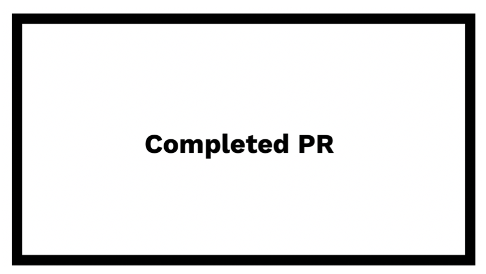

[](/progress-main.md#readme)

# Sprint 13.2 &nbsp;&nbsp; [](./13.1.md#readme)&nbsp;&nbsp;&nbsp;&nbsp;&nbsp;[](./13.3.md#readme) <!-- omit in toc -->

<details>
<summary>Index</summary>

- [**Branches**](#branches)
- [**Details**](#details)
  - [**12345** - User Story 1](#12345---user-story-1)
- [**Tests**](#tests)
  - [**12345** - User Story 1](#12345---user-story-1-1)
- [**Pull Requests**](#pull-requests)
  - [**12345** - User Story 1](#12345---user-story-1-2)
- [**Feedback**](#feedback)
- [**Completed**](#completed)
- [**Retrospective notes**](#retrospective-notes)
- [**Next Sprint**](#next-sprint)

</details>

**Stories**

[12345 - User Story 1](http://link-to-story)

**Bugs**

---

## **Branches**

**12345 - User Story 1**

`story/12345-user-story-1`

---

## **Details**

### **12345** - User Story 1

I added a function - it was amazing <sup>[BCS 01](/goals/BCS-goals.md#01) - Logic</sup>

```js
const thisFunction = () => {
  return 'this worked'
}
```

---

## **Tests**

### **12345** - User Story 1

I added some tests - I am great at tests <sup>[BCS 04](/goals/BCS-goals.md#04) - Test</sup>

```js
it('should work', () => {
  
  expect(thisFunction()).toEqual('this worked')
})
```

---

## **Pull Requests**

### **12345** - User Story 1

[12345 PR](http://link-to-pr)



---

## **Feedback**

:eight_spoked_asterisk: Feedback from Stakeholder - "Amazing work"

---

## **Completed**

I complete everything on the sprint backlog assigned to me

---

## **Retrospective notes**

✅ Really enjoyed owning that project

❌ Took a long time to get my PR reviewed and approved

❓ What are we working on next sprint?

---

## **Next Sprint**

I'll be around the whole sprint
